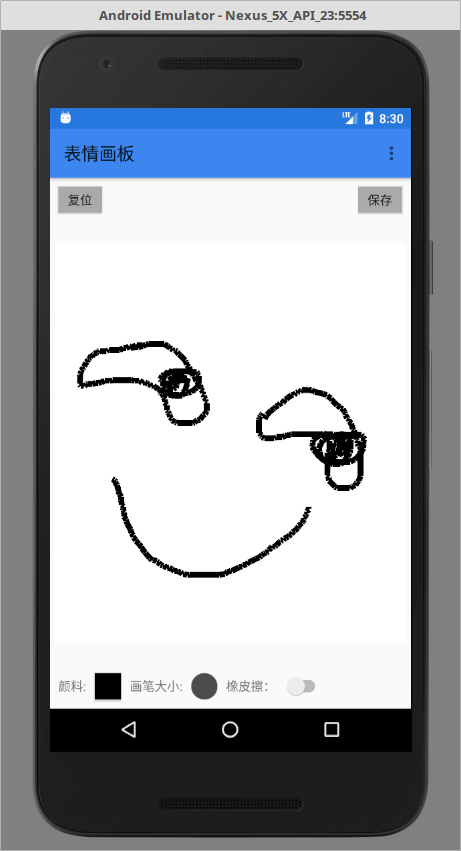
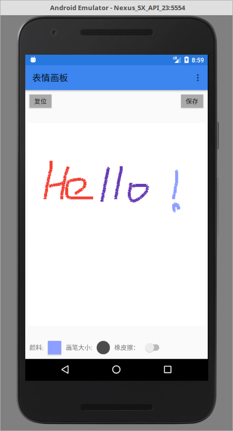

# 《表情画板》
代码阅读对象：Android 开发者，望项目代码对您有利参考。

表情画板，使用画笔完成基本画画，最后保存到存储卡。需要读取存储卡的权限才能保存图片。

<a href="http://android.myapp.com/myapp/detail.htm?apkName=com.panhongyuan.painter">下载apk包</a>

## 免责声明
项目由“极客开发者”（jkdev.cn）编写，源代码开放并共享。

## APP部分截图：
<p>


</p>
## 1. 介绍
原项目构建参数如下：<br>
compileSdkVersion 25<br>
buildToolsVersion '27.0.3'<br>
minSdkVersion 15<br>
targetSdkVersion 25<br>


## 2. 代码下载

1.使用git管理工具下载

```markdown
git clone https://github.com/kotlinup/Painter.git
```
2.直接下载：<br>
在github上找到下载按钮直接下载zip包即可<br>

3.使用Android Studio倒入即可

## 3. 参考内容

## 4. 联系开发者：
(1)邮箱：i@panhongyuan.com<br>
(2)微信订阅：极客开发者up<br>


